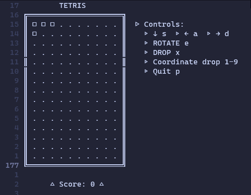
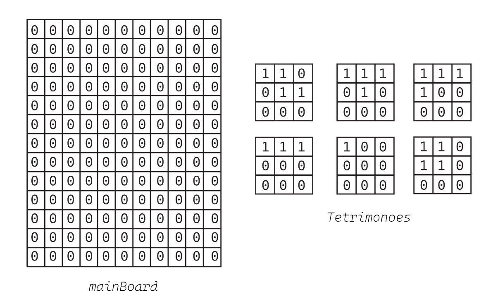
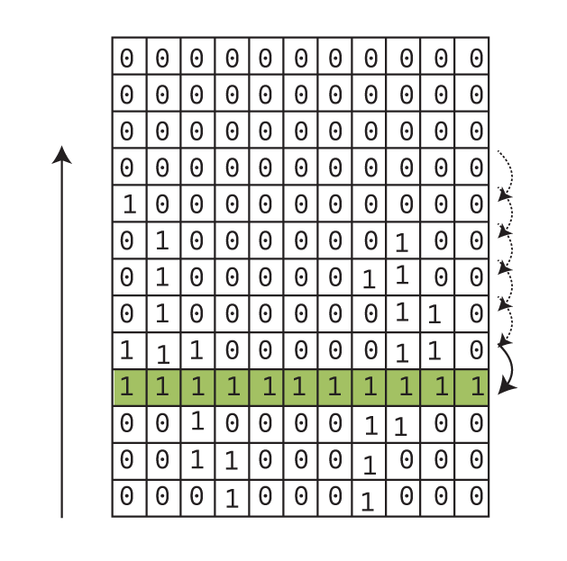
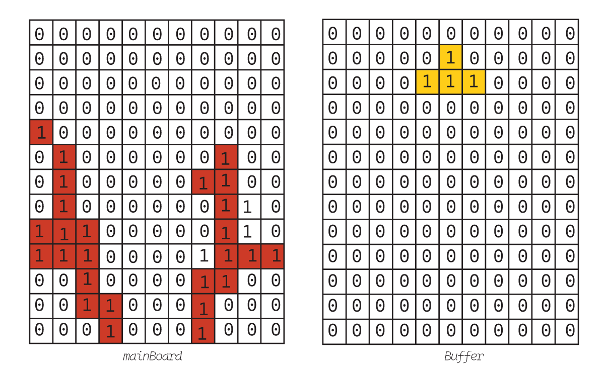

# <em>TETRIS : Behind The Scenes</em>

### _Introduction_:
  Explore the classic joy of Tetris with my C-coded implementation!<br>
  Discover the magic behind the falling blocks, intricate code, and timeless gaming experience.<br> Let's bring the nostalgia to life! 🚀 <br>
  <br>
  


## Rough Explanation:
  First, let's imagine the gameboard and its tetrimnoes as matrices:<br> 
    
  After that, we can easily imagine how the code of the tetrominoes would be:
```
/*This Struct is used to save information about the tetromino*/
typedef struct {
    char **boyut;
    int en;        
    int boy;      
    int x;          
    int y;         
    int tmp_en;
} Parca;

/*get a tetromino*/
Parca eldeParca;

/*define matrices for each tetromino*/
const Parca parcalar[PARCALAR] = {
    {(char *[]){(char[]){1,1,0},(char[]){1,1,0}}, 2, 2},                       
    {(char *[]){(char[]){1,0,0}}, 1, 1},                                      
    {(char *[]){(char[]){1,1,0},(char[]){0,1,1},(char[]){0,0,0}}, 3, 2},     
    {(char *[]){(char[]){1,1,1},(char[]){0,1,0},(char[]){0,0,0}}, 3, 2},    
    {(char *[]){(char[]){1,1,1},(char[]){0,0,0},(char[]){0,0,0}}, 3, 1},   
    {(char *[]){(char[]){1,1,1},(char[]){1,0,0},(char[]){0,0,0}}, 3, 2},  
};
```
So, how much easy it is to check the full rows and overwrite the above ones?


```
void skorlama( int r, int c, char oyun[r][c])
{
 int i, j, sum, count=0;
 for(i=0 ; i<r ; i++){
  sum = 0;
  for(j=0 ; j<c ; j++) {
   sum+=oyun[i][j];
  }
  if(sum == c ){
   count++;
   int l, k;
   for(k = i;k >=1;k--)
    for(l=0 ; l<c ; l++)
     oyun[k][l]=oyun[k-1][l];
   for(l=0 ; l<c ; l++)
    oyun[k][l]=0;
  }
 }
 skor += 100*count*i;
}
```
Last bu not least, we should print or render the board and the tetromino.
As always, while 0s indicates empty areas 1s will indicate full ones. <br>
However, The tetromino that the player contols should be displayed in a different way so we print it as a buffer.


```
oid printleme( int r, int c, char oyun[r][c])
{
 char Buffer[r][c];
 int i, j;
    
    for ( i = 0; i < r; i++)
    {
        for ( j = 0; j < c; j++)
        {
            Buffer[i][j] = 0;
        }
    }
    
 for(i = 0; i < eldeParca.en ;i++){
  for(j = 0; j < eldeParca.en ; j++){
   if(eldeParca.boyut[i][j])
    Buffer[eldeParca.x+i][eldeParca.y+j] = eldeParca.boyut[i][j];
  }
 }
.
.
.
/*check main.c for the full code.*/
```

